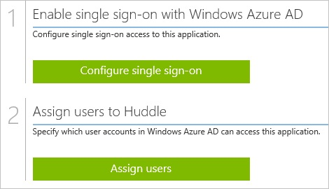
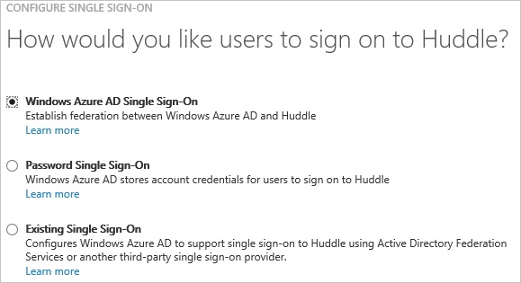
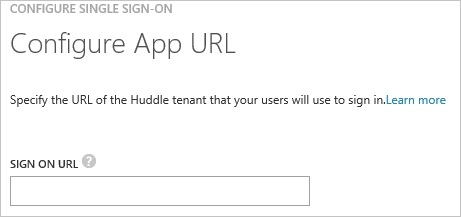
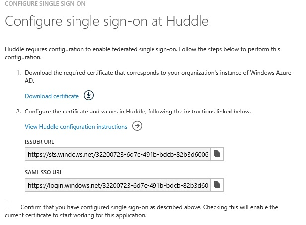
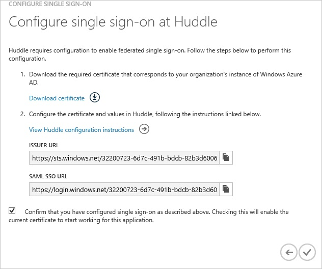
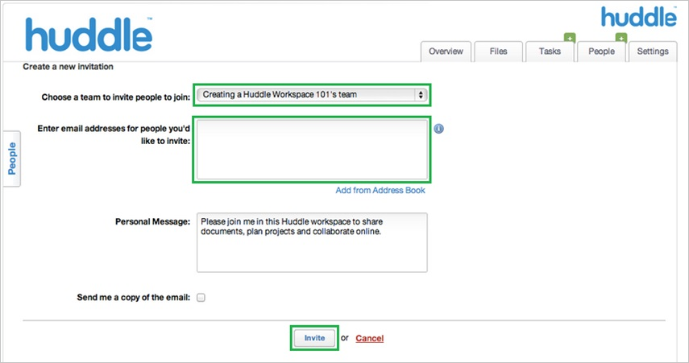

<properties pageTitle="Tutorial: Azure Active Directory integration with Huddle | Microsoft Azure" description="Learn how to use Huddle with Azure Active Directory to enable single sign-on, automated provisioning, and more!." services="active-directory" authors="MarkusVi"  documentationCenter="na" manager="stevenpo"/>
<tags ms.service="active-directory" ms.devlang="na" ms.topic="article" ms.tgt_pltfrm="na" ms.workload="identity" ms.date="08/01/2015" ms.author="markvi" />
#Tutorial: Azure Active Directory integration with Huddle
>[AZURE.TIP]For feedback, click [here](http://go.microsoft.com/fwlink/?LinkId=528081).
  
The objective of this tutorial is to show the integration of Azure and Huddle.  
The scenario outlined in this tutorial assumes that you already have the following items:

-   A valid Azure subscription
-   A Huddle single sign-on enabled subscription
  
After completing this tutorial, the Azure AD users you have assigned to Huddle will be able to single sign into the application at your Huddle company site (service provider initiated sign on), or using the [Introduction to the Access Panel](https://msdn.microsoft.com/library/dn308586)
  
The scenario outlined in this tutorial consists of the following building blocks:

1.  Enabling the application integration for Huddle
2.  Configuring single sign-on
3.  Configuring user provisioning
4.  Assigning users

##Enabling the application integration for Huddle
  
The objective of this section is to outline how to enable the application integration for Huddle.

###To enable the application integration for Huddle, perform the following steps:

1.  In the Azure Management Portal, on the left navigation pane, click **Active Directory**.

    

2.  From the **Directory** list, select the directory for which you want to enable directory integration.

3.  To open the applications view, in the directory view, click **Applications** in the top menu.

    

4.  Click **Add** at the bottom of the page.

    

5.  On the **What do you want to do** dialog, click **Add an application from the gallery**.

    

6.  In the **search box**, type **Huddle**.

    

7.  In the results pane, select **Huddle**, and then click **Complete** to add the application.

    
##Configuring single sign-on
  
The objective of this section is to outline how to enable users to authenticate to Huddle with their account in Azure AD using federation based on the SAML protocol.

###To configure single sign-on, perform the following steps:

1.  In the Azure AD portal, on the **Huddle** application integration page, click **Configure single sign-on** to open the **Configure Single Sign On ** dialog.

    

2.  On the **How would you like users to sign on to Huddle** page, select **Microsoft Azure AD Single Sign-On**, and then click **Next**.

    

3.  On the **Configure App URL** page, in the **Huddle Sign On URL** textbox, type the URL of your Huddle tenant using the following pattern "*http://company.huddle.com*", and then click **Next**.

    

4.  On the **Configure single sign-on at Huddle** page, perform the following steps:

    

    1.  Click **Download certificate**, and then save the certificate file on your computer.
    2.  Copy the **Issuer URL** value, the **SAML SSO URL** value and the downloaded certificate, and then send them to the Huddle support team.

    >[AZURE.NOTE] Single sign-on needs to be enabled by the Huddle support team.
    You will get a notification when the configuration has been completed.

5.  On the Azure AD portal, select the single sign-on configuration confirmation, and then click **Complete** to close the **Configure Single Sign On** dialog.

    
##Configuring user provisioning
  
In order to enable Azure AD users to log into Huddle, they must be provisioned into Huddle.  
In the case of Huddle, provisioning is a manual task.

###To configure user provisioning, perform the following steps:

1.  Log in to your **Huddle** company site as administrator.

2.  Click **Workspace**.

3.  Click **People \> Invite People**.

    

4.  In the **Create a new invitation** section, perform the following steps:

    

    1.  In the **Choose a team to invite people to join** list, select **team**.
    2.  Type the **Email Address** of a valid AAD account you want to provision into the related textbox.
    3.  Click **Invite**.

    >[AZURE.NOTE] The Azure AD account holder will receive an email including a link to confirm the account before it becomes active.

>[AZURE.NOTE] You can use any other Huddle user account creation tools or APIs provided by Huddle to provision AAD user accounts.

##Assigning users
  
To test your configuration, you need to grant the Azure AD users you want to allow using your application access to it by assigning them.

###To assign users to Huddle, perform the following steps:

1.  In the Azure AD portal, create a test account.

2.  On the **Huddle **application integration page, click **Assign users**.

    

3.  Select your test user, click **Assign**, and then click **Yes** to confirm your assignment.

    
  
If you want to test your single sign-on settings, open the Access Panel. For more details about the Access Panel, see [Introduction to the Access Panel](https://msdn.microsoft.com/library/dn308586).
test
