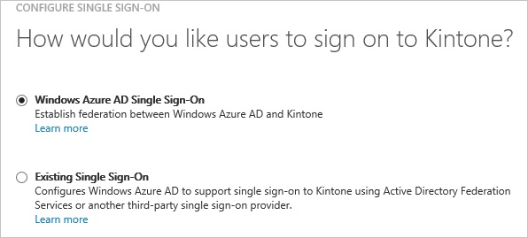
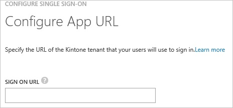
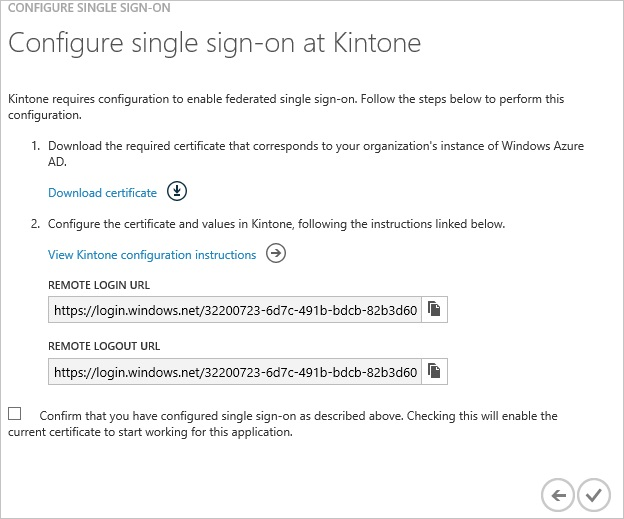
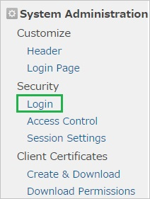
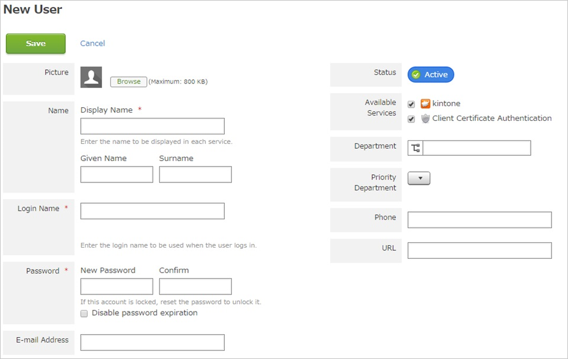

<properties pageTitle="Tutorial: Azure Active Directory Integration with Kintone | Microsoft Azure" description="Learn how to use Kintone with Azure Active Directory to enable single sign-on, automated provisioning, and more!." services="active-directory" authors="MarkusVi"  documentationCenter="na" manager="stevenpo"/>
<tags ms.service="active-directory" ms.devlang="na" ms.topic="article" ms.tgt_pltfrm="na" ms.workload="identity" ms.date="08/01/2015" ms.author="markvi" />
#Tutorial: Azure Active Directory Integration with Kintone
>[AZURE.TIP]For feedback, click [here](http://go.microsoft.com/fwlink/?LinkId=526796).
  
The objective of this tutorial is to show the integration of Azure and Kintone.  
The scenario outlined in this tutorial assumes that you already have the following items:

-   A valid Azure subscription
-   A Kintone single sign-on enabled subscription
  
After completing this tutorial, the Azure AD users you have assigned to Kintone will be able to single sign into the application at your Kintone company site (service provider initiated sign on), or using the [Introduction to the Access Panel](https://msdn.microsoft.com/library/dn308586)
  
The scenario outlined in this tutorial consists of the following building blocks:

1.  Enabling the application integration for Kintone
2.  Configuring single sign-on
3.  Configuring user provisioning
4.  Assigning users

##Enabling the application integration for Kintone
  
The objective of this section is to outline how to enable the application integration for Kintone.

###To enable the application integration for Kintone, perform the following steps:

1.  In the Azure Management Portal, on the left navigation pane, click **Active Directory**.

    

2.  From the **Directory** list, select the directory for which you want to enable directory integration.

3.  To open the applications view, in the directory view, click **Applications** in the top menu.

    

4.  Click **Add** at the bottom of the page.

    

5.  On the **What do you want to do** dialog, click **Add an application from the gallery**.

    

6.  In the **search box**, type **Kintone**.

    

7.  In the results pane, select **Kintone**, and then click **Complete** to add the application.

    
##Configuring single sign-on
  
The objective of this section is to outline how to enable users to authenticate to Kintone with their account in Azure AD using federation based on the SAML protocol.

###To configure single sign-on, perform the following steps:

1.  In the Azure AD portal, on the **Kintone** application integration page, click **Configure single sign-on** to open the **Configure Single Sign On ** dialog.

    

2.  On the **How would you like users to sign on to Kintone** page, select **Microsoft Azure AD Single Sign-On**, and then click **Next**.

    

3.  On the **Configure App URL** page, in the **Kintone Sign On URL** textbox, type your URL using the following pattern "*https://company.kintone.com*", and then click **Next**.

    

4.  On the **Configure single sign-on at Kintone** page, to download your certificate, click **Download certificate**, and then save the certificate file on your computer.

    

5.  In a different web browser window, log into your **Kintone** company site as an administrator.

6.  Click **Settings**.

    

7.  Click **Users & System Administration**.

    

8.  Under **System Administration \> Security** click **Login**.

    

9.  Click **Enable SAML authentication**.

    

10. In the SAML Authentication section, perform the following steps:

    

    1.  In the Azure portal, on the **Configure single sign-on at Kintone** dialog page, copy the **Remote Login URL** value, and then paste it into the **Login URL** textbox.
    2.  In the Azure portal, on the **Configure single sign-on at Kintone** dialog page, copy the **Remote Logout URL** value, and then paste it into the **Logout URL** textbox.
    3.  Click **Browse** to upload your downloaded certificate.
    4.  Click **Save**.

11. On the Azure AD portal, select the single sign-on configuration confirmation, and then click **Complete** to close the **Configure Single Sign On** dialog.

    
##Configuring user provisioning
  
In order to enable Azure AD users to log into Kintone, they must be provisioned into Kintone.  
In the case of Kintone, provisioning is a manual task.

###To provision a user accounts, perform the following steps:

1.  Log in to your **Kintone** company site as an administrator.

2.  Click **Setting**.

    

3.  Click **Users & System Administration**.

    

4.  Under **User Administration**, click **Departments & Users**.

    

5.  Click **New User**.

    

6.  In the **New User** section, perform the following steps:

    

    1.  Type a **Display Name**, **Login Name**, **New Password**, **Confirm Password**, **E-mail Address** and other details of a valid AAD account you want to provision into the related texboxes.
    2.  Click **Save**.

>[AZURE.NOTE] You can use any other Kintone user account creation tools or APIs provided by Kintone to provision AAD user accounts.

##Assigning users
  
To test your configuration, you need to grant the Azure AD users you want to allow using your application access to it by assigning them.

###To assign users to Kintone, perform the following steps:

1.  In the Azure AD portal, create a test account.

2.  On the **Kintone **application integration page, click **Assign users**.

    

3.  Select your test user, click **Assign**, and then click **Yes** to confirm your assignment.

    
  
If you want to test your single sign-on settings, open the Access Panel. For more details about the Access Panel, see [Introduction to the Access Panel](https://msdn.microsoft.com/library/dn308586).
test
