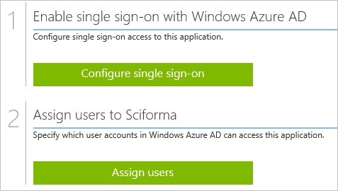
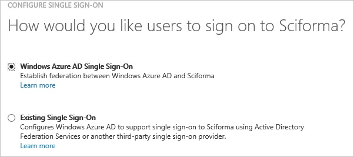
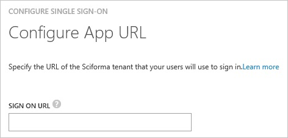
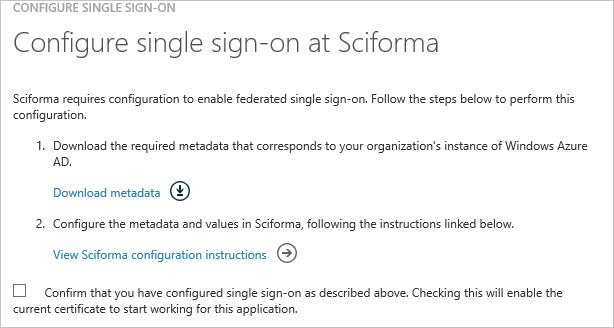
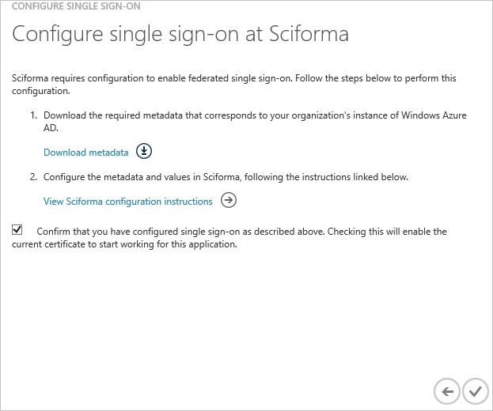

<properties pageTitle="Tutorial: Azure AD integration with Sciforma | Microsoft Azure" description="Learn how to use Sciforma with Azure Active Directory to enable single sign-on, automated provisioning, and more!." services="active-directory" authors="MarkusVi"  documentationCenter="na" manager="stevenpo"/>
<tags ms.service="active-directory" ms.devlang="na" ms.topic="article" ms.tgt_pltfrm="na" ms.workload="identity" ms.date="08/01/2015" ms.author="markvi" />
#Tutorial: Azure AD integration with Sciforma
>[AZURE.TIP]For feedback, click [here](http://go.microsoft.com/fwlink/?LinkId=524480).
  
The objective of this tutorial is to show the integration of Azure and Sciforma.  
The scenario outlined in this tutorial assumes that you already have the following items:

-   A valid Azure subscription
-   A Sciforma tenant
  
After completing this tutorial, the Azure AD users you have assigned to Sciforma will be able to single sign into the application at your Sciforma company site (service provider initiated sign on), or using the [Introduction to the Access Panel](https://msdn.microsoft.com/library/dn308586)
  
The scenario outlined in this tutorial consists of the following building blocks:

1.  Enabling the application integration for Sciforma
2.  Configuring single sign-on
3.  Configuring user provisioning
4.  Assigning users

##Enabling the application integration for Sciforma
  
The objective of this section is to outline how to enable the application integration for Sciforma.

###To enable the application integration for Sciforma, perform the following steps:

1.  In the Azure Management Portal, on the left navigation pane, click **Active Directory**.

    

2.  From the **Directory** list, select the directory for which you want to enable directory integration.

3.  To open the applications view, in the directory view, click **Applications** in the top menu.

    

4.  Click **Add** at the bottom of the page.

    

5.  On the **What do you want to do** dialog, click **Add an application from the gallery**.

    

6.  In the **search box**, type **Sciforma**.

    

7.  In the results pane, select **Sciforma**, and then click **Complete** to add the application.

    
##Configuring single sign-on
  
The objective of this section is to outline how to enable users to authenticate to Sciforma with their account in Azure AD using federation based on the SAML protocol.

###To configure single sign-on, perform the following steps:

1.  In the Azure AD portal, on the **Sciforma** application integration page, click **Configure single sign-on** to open the **Configure Single Sign On ** dialog.

    

2.  On the **How would you like users to sign on to Sciforma** page, select **Microsoft Azure AD Single Sign-On**, and then click **Next**.

    

3.  On the **Configure App URL** page, in the **Sciforma Sign In URL** textbox, type your URL using the following pattern "*https://\<tenant-name\>.Sciforma.com*", and then click **Next**.

    

4.  On the **Configure single sign-on at Sciforma** page, to download your metadata, click **Download metadata**, and then the data file locally as **c:\\SciformaMetaData.xml**.

    

5.  Forward that metadata file to Sciforma support team. The support team needs configures single sign-on for you.

6.  Select the single sign-on configuration confirmation, and then click **Complete** to close the **Configure Single Sign On** dialog.

    
##Configuring user provisioning
  
There is no action item for you to configure user provisioning to Sciforma.  
When an assigned user tries to log into Sciforma using the access panel, Sciforma checks whether the user exists.  
If there is no user account available yet, it is automatically created by Sciforma.
##Assigning users
  
To test your configuration, you need to grant the Azure AD users you want to allow using your application access to it by assigning them.

###To assign users to Sciforma, perform the following steps:

1.  In the Azure AD portal, create a test account.

2.  On the **Sciforma **application integration page, click **Assign users**.

    

3.  Select your test user, click **Assign**, and then click **Yes** to confirm your assignment.

    
  
If you want to test your single sign-on settings, open the Access Panel. For more details about the Access Panel, see [Introduction to the Access Panel](https://msdn.microsoft.com/library/dn308586).
test
