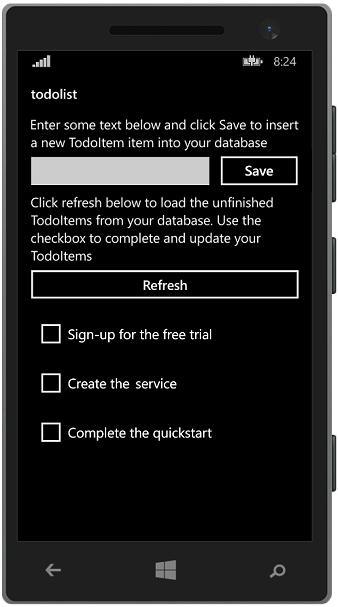

<properties
	pageTitle="Create a Windows Runtime 8.1 universal app on Azure App Service Mobile Apps | Microsoft Azure"
	description="Follow this tutorial to get started with using Azure mobile app backends for Windows Store development in C#, Visual Basic, or JavaScript."
	services="app-service\mobile"
	documentationCenter="windows"
	authors="ggailey777"
	manager="dwrede"
	editor=""/>

<tags
	ms.service="app-service-mobile"
	ms.workload="mobile"
	ms.tgt_pltfrm="mobile-windows"
	ms.devlang="dotnet"
	ms.topic="hero-article"
	ms.date="08/14/2015"
	ms.author="glenga"/>

#Create a Windows app

[AZURE.INCLUDE [app-service-mobile-selector-get-started-preview](../../includes/app-service-mobile-selector-get-started-preview.md)]
&nbsp;
[AZURE.INCLUDE [app-service-mobile-note-mobile-services-preview](../../includes/app-service-mobile-note-mobile-services-preview.md)]

##Overview

This tutorial shows you how to add a cloud-based backend service to a Windows Runtime 8.1 universal app by using an Azure mobile app backend. Universal Windows app solutions include projects for both Windows Store 8.1 and Windows Phone Store 8.1 apps, in addition to a common shared project.

[AZURE.INCLUDE [app-service-mobile-windows-universal-get-started-preview](../../includes/app-service-mobile-windows-universal-get-started-preview.md)]

##Prerequisites

To complete this tutorial, you need the following:

* An active Azure account. If you don't have an account, you can sign up for an Azure trial and get up to 10 free mobile apps that you can keep using even after your trial ends. For details, see [Azure Free Trial](http://azure.microsoft.com/pricing/free-trial/).

* [Visual Studio Community 2013] or a later version.

>[AZURE.NOTE] If you want to get started with Azure App Service before you sign up for an Azure account, go to [Try App Service](http://go.microsoft.com/fwlink/?LinkId=523751&appServiceName=mobile). There, you can immediately create a short-lived starter mobile app in App Service—no credit card required, and no commitments.

##Create a new Azure mobile app backend

[AZURE.INCLUDE [app-service-mobile-dotnet-backend-create-new-service-preview](../../includes/app-service-mobile-dotnet-backend-create-new-service-preview.md)]

## Download the server project

1. In the [Azure portal], click **Browse All** > **Web Apps**, and then click the mobile app backend that you just created.

2. In the mobile app backend, click **All settings**, and then under **Mobile App**, click **Quickstart** > **Windows (C#)**.

3. Under **Download and run your server project** in **Create a new app**, click **Download**, extract the compressed project files to your local computer, and open the solution in Visual Studio.

4. Build the project to restore the NuGet packages.

##Publish the server project to Azure

[AZURE.INCLUDE [app-service-mobile-dotnet-backend-publish-service-preview](../../includes/app-service-mobile-dotnet-backend-publish-service-preview.md)]

##Download and run the client project

Once you have created your mobile app backend, you can follow an easy Quickstart in the Azure portal to either create a new app or modify an existing app to connect to your mobile app backend.

In this section, you download a universal Windows app template project that is customized to connect to your Azure mobile app backend.

1. Back in the blade for your Mobile App backend, click **All settings**, and then under **Mobile App**, click **Quickstart** > **Windows (C#)**.

2.  Under **Download and run your Windows project** in **Create a new app**, click **Download**, and extract the compressed project files to your local computer.

3. (Optional) Add the universal Windows app project to the solution with the server project. This makes it easier to debug and test both the app and the backend in the same Visual Studio solution, if you choose to do so.

4. With the Windows Store app as the startup project, press the F5 key to rebuild the project and start the Windows Store app.

5. In the app, type meaningful text, such as *Complete the tutorial*, in the **Insert a TodoItem** text box, and then click **Save**.

	

	This sends a POST request to the new mobile app backend that's hosted in Azure.

6. Stop debugging, right-click the `<your app name>.WindowsPhone` project, click **Set as StartUp Project**, and then press F5 again.

	

	Notice that data saved from the previous step is loaded from the mobile app after the Windows app starts.

##Next steps

* [Add authentication to your app ](app-service-mobile-dotnet-backend-windows-store-dotnet-get-started-users-preview.md)
   Learn how to authenticate users of your app with an identity provider.

* [Add push notifications to your app](app-service-mobile-dotnet-backend-windows-store-dotnet-get-started-push-preview.md)
   Learn how to send a very basic push notification to your app.

<!-- Anchors. -->
<!-- Images. -->
<!-- URLs. -->
[Get started with authentication]: app-service-mobile-dotnet-backend-windows-store-dotnet-get-started-users-preview.md
[Mobile App SDK]: http://go.microsoft.com/fwlink/?LinkId=257545
[Azure portal]: https://portal.azure.com/
[Visual Studio Community 2013]: https://go.microsoft.com/fwLink/p/?LinkID=534203

test
