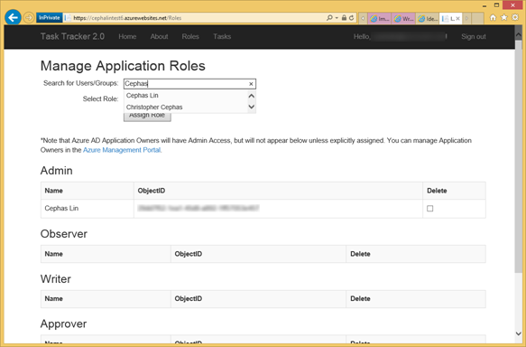
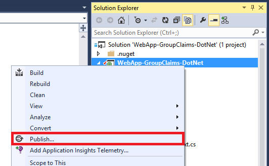
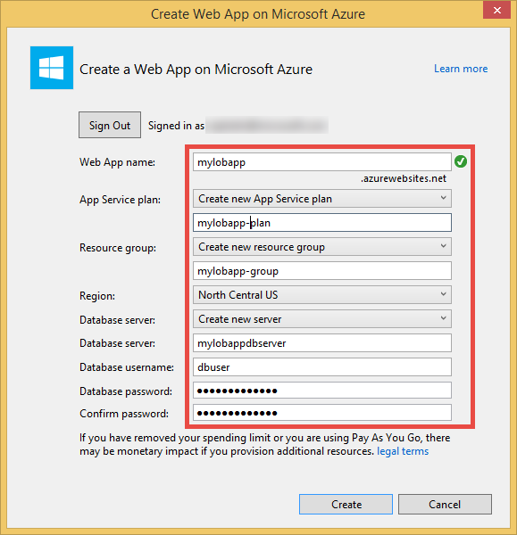
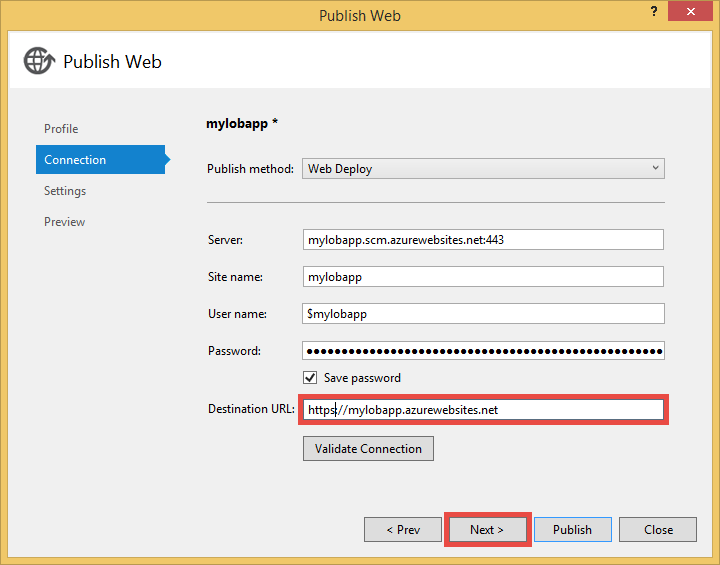
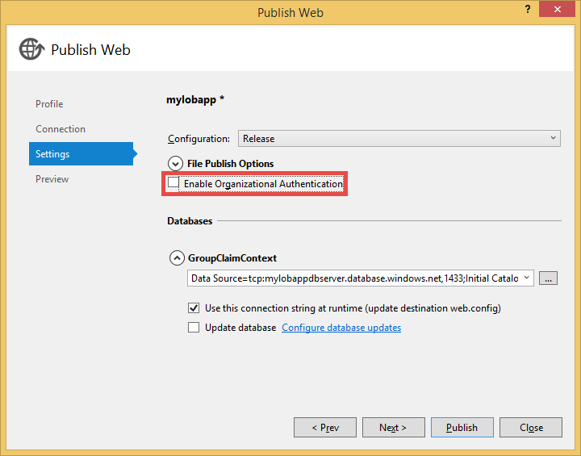
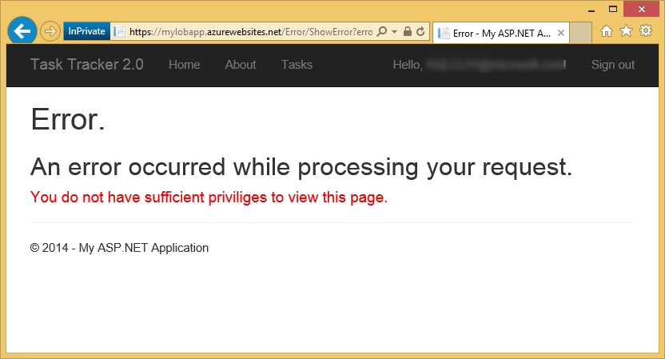

<properties 
	pageTitle="Create a .NET MVC web app in Azure App Service with Azure Active Directory authentication" 
	description="Learn how to create an ASP.NET MVC line-of-business application in Azure App Service that authenticates with Azure Active Directory" 
	services="app-service\web, active-directory" 
	documentationCenter=".net" 
	authors="cephalin" 
	manager="wpickett" 
	editor=""/>

<tags 
	ms.service="app-service-web" 
	ms.devlang="dotnet" 
	ms.topic="article" 
	ms.tgt_pltfrm="na" 
	ms.workload="web" 
	ms.date="07/07/2015" 
	ms.author="cephalin"/>

# Create a .NET MVC web app in Azure App Service with Azure Active Directory authentication #

In this article, you will learn how to create an ASP.NET MVC line-of-business application in [Azure App Service Web Apps](http://go.microsoft.com/fwlink/?LinkId=529714) using [Azure Active Directory](/services/active-directory/) as the identity provider. You will also learn how to use the [Azure Active Directory Graph Client Library](http://blogs.msdn.com/b/aadgraphteam/archive/2014/06/02/azure-active-directory-graph-client-library-1-0-publish.aspx) to query directory data in the application.

The Azure Active Directory tenant that you use can be an Azure-only directory, or it can be directory-synced with your on-premise Active Directory (AD) to create a single sign-on experience for workers that are on-premise or remote.

>[AZURE.NOTE] For Azure App Service Web Apps you can configure authentication against an Azure Active Directory tenant with a few clicks of a button. For more information, see [Use Active Directory for authentication in Azure App Service](web-sites-authentication-authorization.md).

## What you will build ##

You will build a simple line-of-business Create-Read-Update-Delete (CRUD) application in App Service Web Apps that tracks work items with the following features:

- Authenticates users against Azure Active Directory
- Implements sign-in and sign-out functionality
- Uses `[Authorize]` to authorize users for different CRUD actions
- Queries Azure Active Directory data using [Azure Active Directory Graph API](http://msdn.microsoft.com/library/azure/hh974476.aspx)
- Uses [Microsoft.Owin](http://www.asp.net/aspnet/overview/owin-and-katana/an-overview-of-project-katana) (instead of Windows Identity Foundation, i.e. WIF), which is the future of ASP.NET and much simpler to set up for authentication and authorization than WIF

## What you will need ##

[AZURE.INCLUDE [free-trial-note](../../includes/free-trial-note.md)]

>[AZURE.NOTE] If you want to get started with Azure App Service before signing up for an Azure account, go to [Try App Service](http://go.microsoft.com/fwlink/?LinkId=523751), where you can immediately create a short-lived starter web app in App Service. No credit cards required; no commitments.

You need the following to complete this tutorial:

- An Azure Active Directory tenant with users in various groups
- Permissions to create applications on the Azure Active Directory tenant
- Visual Studio 2013
- [Azure SDK 2.5.1](http://go.microsoft.com/fwlink/p/?linkid=323510&clcid=0x409) or later

## Use sample application for line-of-business template ##

The sample application in this tutorial, [WebApp-GroupClaims-DotNet](https://github.com/AzureADSamples/WebApp-GroupClaims-DotNet), is created by the Azure Active Directory team and can be used as a template to create new line-of-business applications with ease. It has the following built-in features:

- Uses [OpenID Connect](http://openid.net/connect/) to authenticate with Azure Active Directory
- `Roles` controller that contains an Azure Active Directory search filter and enables you to easily map Azure Active Directory users or groups to application roles.
- Sample `TaskTracker` controller that demonstrates how you can authorize different roles for specific actions in the application, including the standard usage of `[Authorize]`. 

<a name="bkmk_run" />
## Run the sample application ##

1.	Clone or download the sample solution at [WebApp-GroupClaims-DotNet](https://github.com/AzureADSamples/WebApp-GroupClaims-DotNet) to your local directory.

2.	Follow the instructions at [README.md](https://github.com/AzureADSamples/WebApp-GroupClaims-DotNet/blob/master/README.md) to set up the Azure Active Directory application and project.

	> [AZURE.NOTE] The permissions configured in the Azure Active Directory application requires the <strong>User</strong> role; not **Global Administrator**.
	
3.	Once you're finished configuring the application, type `F5` to run the application.

4.	Once the application loads, click **Sign In**. 

5.	If you configured the Azure Active Directory application properly and set the corresponding settings in Web.config, you should be redirected to the log in. Simply log in with the account you used to create the Azure Active Directory application in the Azure portal, since it's the Azure Active Directory application's default owner. 
	
	> [AZURE.NOTE] In Startup.Auth.cs of the sample project, note that the application has a method called <code>AddOwnerAdminClaim</code>, which it uses to add the application owner into the Admin role. This enables you to immediately start managing application roles in the <code>Roles</code> controller.
	
4.	Once signed in, click **Roles** to manage application roles.

5.	In **Search for Users/Groups**, start typing the desired user name or group name and notice that a dropdown list shows a filtered list of users and/or groups from your Azure Active Directory tenant.

	 

	> [AZURE.NOTE] In Views\Roles\Index.cshtml, you will see that the view uses a JavaScript object called <code>AadPicker</code> (defined in Scripts\AadPickerLibrary.js) to access the <code>Search</code> action in the <code>Roles</code> controller.
		<pre class="prettyprint">var searchUrl = window.location.protocol + "//" + window.location.host + "<mark>/Roles/Search</mark>";
	...
    var picker = new <mark>AadPicker(searchUrl, maxResultsPerPage, input, token, tenant)</mark>;</pre>
		In Controllers\RolesController.cs, you will see the <code>Search</code> action, which sends the actual request to the Azure Active Directory Graph API and returns the response back to the page.
		Later, you will use the same method to create simple functionality in your application.

6.	Select a user or group from the dropdown, select a role, and click **Assign Role**.

## Deploy the sample application to App Service Web Apps

Here, you will publish the application to a web app in Azure App Service. There are already instructions at [README.md](https://github.com/AzureADSamples/WebApp-GroupClaims-DotNet/blob/GroupClaims/README.md) for deploying to App Service Web Apps, but those steps also annul the configuration for your local debug environment. I'll show you how to deploy while preserving the debug configuration.

1. Right-click your project and select **Publish**.

	

2. Select **Microsoft Azure Web Apps**.

3. If you haven't signed in to Azure, click **Sign In** and use the Microsoft account for your Azure subscription to sign in.

4. Once signed in, click **New** to create a new web app in Azure.

5. Fill in all required fields. You will need a database connection for this application to store role mappings, cached tokens, and any application data.

	

6. Click **Create**. Once the web app is created, the **Publish Web** dialog is opened.

7. In **Destination URL**, change **http** to **https**. Copy the entire URL to a text editor. You will use it later. Then, click **Next**.

	

8. Clear the **Enable Organizational Authentication** checkbox.

	

9. Instead of clicking **Publish** to go through with the web publish, click **Close**. Click **Yes** to save the changes to the publishing profile.

2. In the [Azure management portal](https://manage.windowsazure.com), go to your Azure Active Directory tenant and click the **Applications** tab.

2. Click **Add** at the bottom of the page.

3. Select **Web Application And/Or Web API**.

4. Give the application a name and click **Next**.

5. In App Properties, set **Sign-On URL** to the web app URL that you saved earler (e.g. `https://<site-name>.azurewebsites.net`), and the **APP ID URI** to `https://<aad-tenanet-name>/<app-name>`. Then, click **Complete**.

	

6. Once the application is created, click **Configure**.

7. Under **Keys**, create a new key by selecting **1 year** in the dropdown.

8. Under **Permissions to other applications**, for the **Azure Active Directory** entry, select **Access your organization's directory** in the **Delegated Permissions** dropdown.

	> [AZURE.NOTE] The exact permissions you need here depends on the desired functionality of your application. Some permissions require the **Global Administrator** role to set, but the permissions required by this tutorial only requires the **User** role.

9.  Click **Save**.  

10.  Before you navigate away from the saved configuration page, copy the following information into a text editor.

	-	Client ID
	-	Key (if you navigate away from the page, you will not be able to see the key again)

11. In Visual Studio, open **Web.Release.config** in your project. Insert the following XML into the `<configuration>` tag, and replace the value of each key with the information that you saved for your new Azure Active Directory application.  
	<pre class="prettyprint">
&lt;appSettings&gt;
   &lt;add key="ida:ClientId" value="<mark>[e.g. 82692da5-a86f-44c9-9d53-2f88d52b478b]</mark>" xdt:Transform="SetAttributes" xdt:Locator="Match(key)" /&gt;
   &lt;add key="ida:AppKey" value="<mark>[e.g. rZJJ9bHSi/cYnYwmQFxLYDn/6EfnrnIfKoNzv9NKgbo=]</mark>" xdt:Transform="SetAttributes" xdt:Locator="Match(key)" /&gt;
   &lt;add key="ida:PostLogoutRedirectUri" value="<mark>[e.g. https://mylobapp.azurewebsites.net/]</mark>" xdt:Transform="SetAttributes" xdt:Locator="Match(key)" /&gt;
&lt;/appSettings&gt;</pre>

	Make sure that the value of ida:PostLogoutRedirectUri ends with a slash "/".

1. Right-click your project and select **Publish**.

2. Click **Publish** to publish to Azure App Service Web Apps.

When you're done, you have two Azure Active Directory applications configured in the Azure management portal: one for your debug environment in Visual Studio, and one for the published web app in Azure. During debugging, the app settings in Web.config are used to make your **Debug** configuration work with Azure Active Directory, and when it's published (by default, the **Release** configuration is published), a transformed Web.config is uploaded that incorporates the app setting changes in Web.Release.config.

If you want to attach the published web app to the debugger (you must upload debug symbols of your code in the published web app), you can create a clone of the Debug configuration for Azure debugging, but with its own custom Web.config transform (e.g. Web.AzureDebug.config) that uses the Azure Active Directory settings from Web.Release.config. This allows you to maintain a static configuration across the different environments.

## Add line-of-business functionality to the sample application

In this part of the tutorial, you will learn how to build out the desired line-of-business functionality based on the sample application. You will create a simple CRUD work items tracker, similar to the TaskTracker controller but using standard CRUD scaffolding and design pattern. You will also use the included Scripts\AadPickerLibrary.js to enrich your application with data from the Azure Active Directory Graph API.  

5.	In the Models folder, create a new model called WorkItem.cs, and replace the code with the code below:

		using System.ComponentModel.DataAnnotations;
		
		namespace WebAppGroupClaimsDotNet.Models
		{
		    public class WorkItem
		    {
		        [Key]
		        public int ItemID { get; set; }
		        public string AssignedToID { get; set; }
		        public string AssignedToName { get; set; }
		        public string Description { get; set; }
		        public WorkItemStatus Status { get; set; }
		    }
		
		    public enum WorkItemStatus
		    {
		        Open, 
		        Investigating, 
		        Resolved, 
		        Closed
		    }
		}

6.	Open DAL\GroupClaimContext.cs and add the highlighted code:  
	<pre class="prettyprint">
    public class GroupClaimContext : DbContext
    {
        public GroupClaimContext() : base("GroupClaimContext") { }

        public DbSet&lt;RoleMapping&gt; RoleMappings { get; set; }
        public DbSet&lt;Task&gt; Tasks { get; set; }
        <mark>public DbSet&lt;WorkItem&gt; WorkItems { get; set; }</mark>
        public DbSet&lt;TokenCacheEntry&gt; TokenCacheEntries { get; set; }
    }</pre>

7.	Build the project to make your new model accessible to the scaffolding logic in Visual Studio.

8.	Add a new scaffolded item `WorkItemsController` to the Controllers folder. To do this, right-click **Controllers**, point to **Add**, and select **New scaffolded item**. 

9.	Select **MVC 5 Controller with views, using Entity Framework** and click **Add**.

10.	Select the model that you just created and click **Add**.

	

9.	Open Controllers\WorkItemsController.cs

11. Add the highlighted [Authorize] decorations to the respective actions below.
	<pre class="prettyprint">
	...

    <mark>[Authorize(Roles = "Admin, Observer, Writer, Approver")]</mark>
    public class WorkItemsController : Controller
    {
		...

        <mark>[Authorize(Roles = "Admin, Writer")]</mark>
        public ActionResult Create()
        ...

        <mark>[Authorize(Roles = "Admin, Writer")]</mark>
        public async Task&lt;ActionResult&gt; Create([Bind(Include = "ItemID,AssignedToID,AssignedToName,Description,Status")] WorkItem workItem)
        ...

        <mark>[Authorize(Roles = "Admin, Writer")]</mark>
        public async Task&lt;ActionResult&gt; Edit(int? id)
        ...

        <mark>[Authorize(Roles = "Admin, Writer")]</mark>
        public async Task&lt;ActionResult&gt; Edit([Bind(Include = "ItemID,AssignedToID,AssignedToName,Description,Status")] WorkItem workItem)
        ...

        <mark>[Authorize(Roles = "Admin, Writer, Approver")]</mark>
        public async Task&lt;ActionResult&gt; Delete(int? id)
        ...

        <mark>[Authorize(Roles = "Admin, Writer, Approver")]</mark>
        public async Task&lt;ActionResult&gt; DeleteConfirmed(int id)
        ...
	}</pre>

	Since you take care of role mappings in the Roles controller, all you need to do is make sure that each action authorizes the right roles.

	> [AZURE.NOTE] You may have noticed the <code>[ValidateAntiForgeryToken]</code> decoration on some of the actions. Due to the behavior described by [Brock Allen](https://twitter.com/BrockLAllen) at [MVC 4, AntiForgeryToken and Claims](http://brockallen.com/2012/07/08/mvc-4-antiforgerytoken-and-claims/) your HTTP POST may fail anti-forgery token validation because:
	> + Azure Active Directory does not send the http://schemas.microsoft.com/accesscontrolservice/2010/07/claims/identityprovider, which is required by default by the anti-forgery token.
	> + If Azure Active Directory is directory synced with AD FS, the AD FS trust by default does not send the http://schemas.microsoft.com/accesscontrolservice/2010/07/claims/identityprovider claim either, although you can manually configure AD FS to send this claim.
	> You will take care of this in the next step.

12.  In App_Start\Startup.Auth.cs, add the following line of code in the `ConfigureAuth` method:

		AntiForgeryConfig.UniqueClaimTypeIdentifier = ClaimTypes.NameIdentifier;
	
	`ClaimTypes.NameIdentifies` specifies the claim `http://schemas.xmlsoap.org/ws/2005/05/identity/claims/nameidentifier`, which Azure Active Directory does supply. Now that you have taken care of the authorization part (seriously, that didn't take long), you can devote your time to the actual functionality of the actions. 

13.	In Create() and Edit() add following code to make some variables available to your JavaScript later:
            ViewData["token"] = GraphHelper.AcquireToken(ClaimsPrincipal.Current.FindFirst(Globals.ObjectIdClaimType).Value);
            ViewData["tenant"] = ConfigHelper.Tenant;

14.	In Views\WorkItems\Create.cshtml (an automatically scaffolded item), find the `Html.BeginForm` helper method and modify it as follows:  
	<pre class="prettyprint">@using (Html.BeginForm(<mark>"Create", "WorkItems", FormMethod.Post, new { id = "main-form" }</mark>))
	{
	    @Html.AntiForgeryToken()
	    
	    &lt;div class="form-horizontal"&gt;
	        &lt;h4&gt;WorkItem&lt;/h4&gt;
	        &lt;hr /&gt;
	        @Html.ValidationSummary(true, "", new { @class = "text-danger" })
	
	        &lt;div class="form-group"&gt;
	            &lt;div class="col-md-10"&gt;
	                @Html.EditorFor(model =&gt; model.AssignedToID, new { htmlAttributes = new { @class = "form-control"<mark>, @type=&quot;hidden&quot;</mark> } })
	                @Html.ValidationMessageFor(model =&gt; model.AssignedToID, "", new { @class = "text-danger" })
	            &lt;/div&gt;
	        &lt;/div&gt;
	
	        &lt;div class="form-group"&gt;
	            @Html.LabelFor(model =&gt; model.AssignedToName, htmlAttributes: new { @class = "control-label col-md-2" })
	            &lt;div class="col-md-10"&gt;
	                @Html.EditorFor(model =&gt; model.AssignedToName, new { htmlAttributes = new { @class = "form-control" } })
	                @Html.ValidationMessageFor(model =&gt; model.AssignedToName, "", new { @class = "text-danger" })
	            &lt;/div&gt;
	        &lt;/div&gt;
	
	        &lt;div class="form-group"&gt;
	            @Html.LabelFor(model =&gt; model.Description, htmlAttributes: new { @class = "control-label col-md-2" })
	            &lt;div class="col-md-10"&gt;
	                @Html.EditorFor(model =&gt; model.Description, new { htmlAttributes = new { @class = "form-control" } })
	                @Html.ValidationMessageFor(model =&gt; model.Description, "", new { @class = "text-danger" })
	            &lt;/div&gt;
	        &lt;/div&gt;
	
	        &lt;div class="form-group"&gt;
	            @Html.LabelFor(model =&gt; model.Status, htmlAttributes: new { @class = "control-label col-md-2" })
	            &lt;div class="col-md-10"&gt;
	                @Html.EnumDropDownListFor(model =&gt; model.Status, htmlAttributes: new { @class = "form-control" })
	                @Html.ValidationMessageFor(model =&gt; model.Status, "", new { @class = "text-danger" })
	            &lt;/div&gt;
	        &lt;/div&gt;
	
	        &lt;div class="form-group"&gt;
	            &lt;div class="col-md-offset-2 col-md-10"&gt;
	                &lt;input type="submit" value="Create" class="btn btn-default" <mark>id="submit-button"</mark> /&gt;
	            &lt;/div&gt;
	        &lt;/div&gt;
	    &lt;/div&gt;
	
	    <mark>&lt;script&gt;
	            // People/Group Picker Code
	            var maxResultsPerPage = 14;
	            var searchUrl = window.location.protocol + "//" + window.location.host + "/Roles/Search";
	            var input = document.getElementById("AssignedToName");
	            var token = "@ViewData["token"]";
	            var tenant = "@ViewData["tenant"]";
	
	            var picker = new AadPicker(searchUrl, maxResultsPerPage, input, token, tenant);
	
	            // Submit the selected user/group to be asssigned.
	            $("#submit-button").click({ picker: picker }, function () {
	                if (!picker.Selected())
	                    return;
	                $("#main-form").get()[0].elements["AssignedToID"].value = picker.Selected().objectId;
	            });
	    &lt;/script&gt;</mark>
	
	}</pre>

	In the script, the AadPicker object searches the `~/Roles/Search` action for Azure Active Directory users and groups that match the input. Then, when the submit button is clicked, the AadPicker object saves the user ID to the hidden `AssignedToID` field.  

15. Now either run the app in the Visual Studio debugger or publish to Azure App Service Web Apps. Log in as the application owner and navigate to `~/WorkItems/Create`. For my published line-of-business app, I navigate to `https://mylobapp.azurewebsites.net/WorkItems/Create`. You'll see now that you you can use the same AadPicker search filter to pick an Azure Active Directory user.

	

16. Fill out the rest of the form and click **Create**. The ~/WorkItems/Index page now shows the newly created work item. You'll also notice in the screenshot below that I removed the `AssignedToID` column in Views\WorkItems\Index.cshtml. 

	

11.	Now, make similar changes to the **Edit** view. In Views\WorkItems\Edit.cshtml, make the changes to the `Html.BeginForm` helper method that are identical to the ones for Views\WorkItems\Create.cshtml in the previous step (replace "Create" with "Edit" in the highlighted code above).

That's it!

Now that you have configured the authorizations and line-of-business functionality for the different actions in the WorkItems controller, you can try to log in as users of different application roles.

## Further resources

- [Protect the Application with SSL and the Authorize Attribute](web-sites-dotnet-deploy-aspnet-mvc-app-membership-oauth-sql-database.md#protect-the-application-with-ssl-and-the-authorize-attribute)
- [Use Active Directory for authentication in Azure App Service](web-sites-authentication-authorization.md)
- [Create a .NET MVC web app in Azure App Service with AD FS authentication](web-sites-dotnet-lob-application-adfs.md)
- [Microsoft Azure Active Directory Samples and Documentation](https://github.com/AzureADSamples)
- [Vittorio Bertocci's blog](http://blogs.msdn.com/b/vbertocci/)
- [Migrate a VS2013 Web Project From WIF to Katana](http://www.cloudidentity.com/blog/2014/09/15/MIGRATE-A-VS2013-WEB-PROJECT-FROM-WIF-TO-KATANA/)
- [Azure's new Hybrid Connections not your father's #hybridCloud](/documentation/videos/new-hybrid-connections-not-your-fathers-hybridcloud/)
- [Similarities between Active Directory and Azure Active Directory](http://technet.microsoft.com/library/dn518177.aspx)
- [Directory Sync with Single Sign-On Scenario](http://technet.microsoft.com/library/dn441213.aspx)
- [Azure Active Directory Supported Token and Claim Types](http://msdn.microsoft.com/library/azure/dn195587.aspx)

[AZURE.INCLUDE [app-service-web-whats-changed](../../includes/app-service-web-whats-changed.md)]

[AZURE.INCLUDE [app-service-web-try-app-service](../../includes/app-service-web-try-app-service.md)]
 

test
