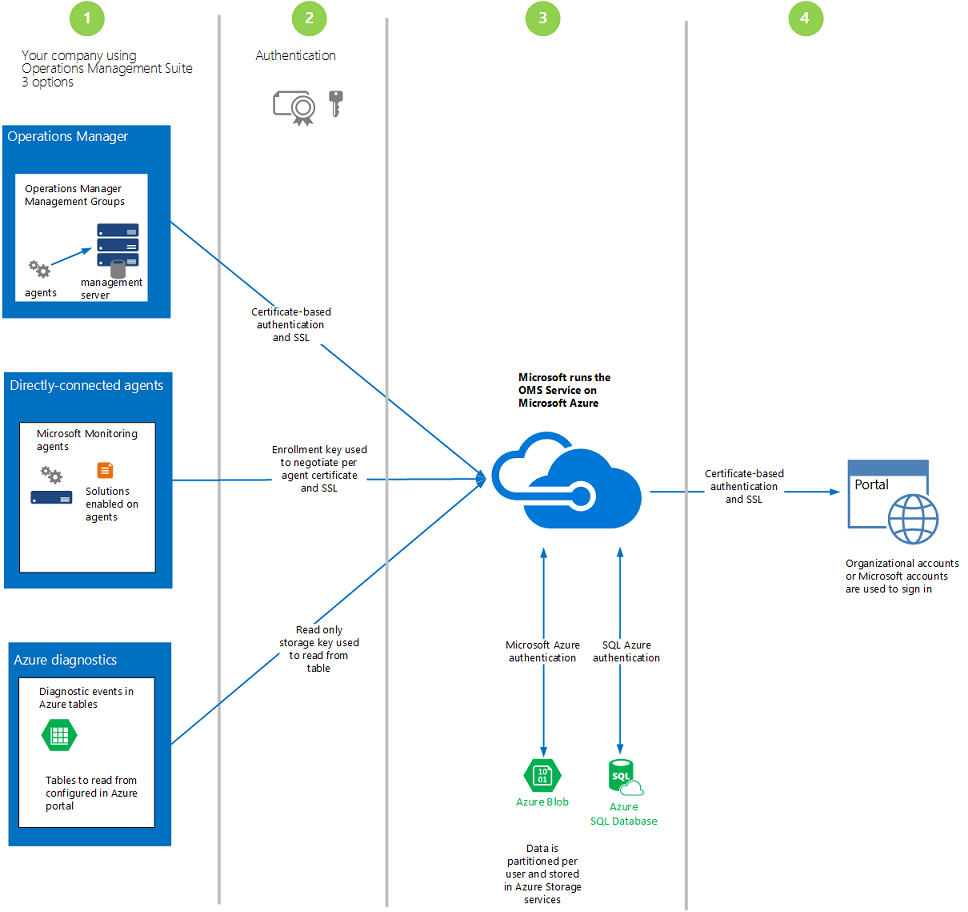

<properties
	pageTitle="Operational Insights Feature Guide"
	description="Operational Insights is an analysis service that enables IT administrators to gain deep insight across on-premises and cloud environments. It enables you to interact with real-time and historical machine data to rapidly develop custom insights, and provides Microsoft and community-developed patterns for analyzing data."
	services="operational-insights"
	documentationCenter=""
	authors="bandersmsft"
	manager="jwhit"
	editor=""/>

<tags
	ms.service="operational-insights"
	ms.workload="na"
	ms.tgt_pltfrm="na"
	ms.devlang="na"
	ms.topic="get-started-article"
	ms.date="08/06/2015"
	ms.author="banders"/>

# Operational Insights feature guide

[AZURE.INCLUDE [operational-insights-note-moms](../../includes/operational-insights-note-moms.md)]

This article helps you understand what problems Operational Insights can help you solve, what the Operational Insights environment consists of, and how you can create an Operational Insights account and sign in to the service.

## Transform machine data

Operational Insights is an analysis service that enables IT administrators to gain deep insight across on-premises and cloud environments. It enables you to interact with real-time and historical machine data to rapidly develop custom insights, and provides Microsoft and community-developed patterns for analyzing data.

With Operational Insights, you can transform machine data into operational intelligence with the following features.

|**Icon** | **What to use** | **What it does**|
|---|---|---|
| | [Capacity Planning](operational-insights-capacity.md) | You can use the Capacity Planning solution in Microsoft Azure Operational Insights to help you understand the capacity of your server infrastructure. |
|  | [System Update Assessment](operational-insights-updates.md) | You can use the System Updates solution in Microsoft Azure Operational Insights to help you apply missing updates to servers in your infrastructure. |
|  | [Log Search](operational-insights-search.md) | You use the Log Search feature to create queries to transform, filter, and report on your results. Search uses event data and IIS logs for log searches throughout Operational Insights. |
|  | [Malware Assessment](operational-insights-antimalware.md) | You can use the Antimalware solution in Microsoft Azure Operational Insights to help you protect the servers in your infrastructure from malware. |
|  | [Security and Audit](operational-insights-security-audit.md) | You can use the Security and Audit solution to get a comprehensive view into your organization’s IT security posture with built-in search queries for notable issues that require your attention. |
|  | [Active Directory and SQL Assessment](operational-insights-assessment.md) | You can use Assessment solutions to assess the risk and health of your server environments on a regular interval. |
|  | [Alert Management](operational-insights-alerts.md) | You can use the Alert Management solution to manage alerts from servers monitored by Operations Manager. |

You can also:

- **Send machine data to the system with or without using an agent or in conjunction with System Center Operations Manager**. For more information, see:
	- [Connect to Operational Insights from System Center Operations Manager](operational-insights-connect-scom.md)
	- [Connect computers directly to Operational Insights](operational-insights-direct-agent.md)
	- [Analyze data from servers in Microsoft Azure](operational-insights-analyze-data-azure.md)
- **Do all of the above on the go with the mobile application**
	- For more information about the Windows Phone application, see [Operational Insights Mobile app](http://www.windowsphone.com/en-us/store/app/operational-insights/4823b935-83ce-466c-82bb-bd0a3f58d865).

## Operational Insights environment

The Operational Insights environment is made up of:

- Microsoft Azure-hosted workspaces which are containers for Azure accounts
- the Operational Insights web service, which is hosted in the cloud
- either separate agents that connect directly to the web service
- or, an attached service to System Center Operations Manager, but is not required

If you used the previous version of Operational Insights called System Center Advisor, you might have Advisor software installed in your local environment. However, Advisor software is not supported with Operational Insights.

Using Operational Insights software as an Operations Manager service consists of one or more management groups and at least one agent per management group. The Operations Manager agents collect data from your servers and analyze it by using solutions (similar to a management pack in System Center Operations Manager). The data is regularly sent from Operations Manager to the Operational Insights web service (if needed, passing through a proxy server), with nothing being stored in any of the Operations Manager databases, so there is no additional load placed on them.

Similarly, agents installed on individual computers can connect directly to the web service to send collected data for processing.

The data in each solution is analyzed, indexed, and presented in the Operational Insights portal. You can view any alerts and associated remediation guidance, configuration assessments, infrastructure capacity issues, system update status, antimalware warnings, and log data. You can also perform detailed ad-hoc log searches and explorations.

### Where is Operational Insights Available?
Microsoft Azure Operational Insights is hosted in the United States. Although the language of Operational Insights is English, the service is available in a number of additional markets. For information, see [International Availability](http://go.microsoft.com/fwlink/?LinkId=229842).
