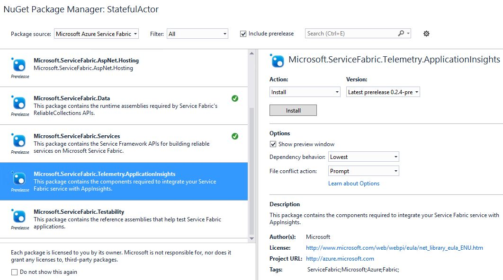
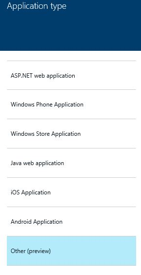

<properties
   pageTitle="Setting up Application Insights for your Service Fabric application"
   description="Receive Service Fabric events for your application in Application Insights."
   services="service-fabric"
   documentationCenter=".net"
   authors="mattrowmsft"
   manager="timlt"
   editor=""/>

<tags
   ms.service="service-fabric"
   ms.devlang="dotNet"
   ms.topic="article"
   ms.tgt_pltfrm="NA"
   ms.workload="NA"
   ms.date="07/20/2015"
   ms.author="mattrow"/>

# Setting up Application Insights for your Service Fabric application
 This article will walk you through enabling Application Insights for your Service Fabric application.

## Prerequisites

This article assumes you have a Service Fabric application already created in Visual Studio. To find out how [click here](service-fabric-reliable-services-quick-start.md).

## Installing the NuGet package
Released as part of the Service Fabric SDK is a prerelease version of our nuget package Microsoft.ServiceFabric.Telemetry.ApplicationInsights. 
This package ties together the Service Fabric EventSource events with Application Insights to give you automated instrumentation of your Service Fabric app.
This package will be continue to be updated with new events which will be automatically emitted by your application.

You can install the package with the following steps:

1. Open the NuGet Package Manager for your Service Fabric app.  This can be done by right-clicking your project in Visual Studio and selecting 'Manage NuGet Packages...'.
2. You will need to select 'Microsoft Azure Service Fabric' as your package source to list packages included in the Service Fabric SDK. 

3. Select the Microsoft.ServiceFabric.Telemetry.ApplicationInsights package on the left.
4. Click Install to begin the install process.
5. Review and accept the EULA.

## Enabling Service Fabric events
In order to receive Service Fabric events automatically in Application Insights you will need to enable our listener.
You can do this by inserting the following line of code into your app.

```csharp
    Microsoft.ServiceFabric.Telemetry.ApplicationInsights.Listener.Enable(EventLevel.Verbose);
```
 
### Example for StatefulActor\Program.cs:

```csharp
    public static void Main(string[] args)
    {
        Microsoft.ServiceFabric.Telemetry.ApplicationInsights.Listener.Enable(EventLevel.Verbose);
        try
        {
            using (FabricRuntime fabricRuntime = FabricRuntime.Create())
            {
                fabricRuntime.RegisterActor(typeof(StatefulActor));

                Thread.Sleep(Timeout.Infinite);
            }
        }
        catch (Exception e)
        {
            ActorEventSource.Current.ActorHostInitializationFailed(e);
            throw;
        }
    }
```

You can learn about the events emitted from the Reliable Actors runtime [here](service-fabric-reliable-actors-diagnostics.md) and Reliable Services runtime [here](service-fabric-reliable-services-diagnostics.md).

Note that in order to get Reliable Actors runtime method calls, EventLevel.Verbose must be used (as shown in examples above).

## Setting up Application Insights
An instrumentation key is what ties your Service Fabric app to your Application Insights resource.  You can learn how to get your instrumentation key by following [Application Insight's guide](../app-insights-create-new-resource.md#create-an-application-insights-resource).
Select 'Other' for application type when creating resources.



Once you have your instrumentation key, you can insert it into the ApplicationInsights.config file like so:

```xml
    <InstrumentationKey>INSERT YOUR KEY HERE</InstrumentationKey>
```

## Viewing data
You can [customize the App Insights blade](../app-insights-metrics-explorer.md) to fit your needs. 
Most Service Fabric events will show up as 'Custom Events', while Fabric Actor method calls and service RunAsync() calls will show up as requests.  
Modeling these events as requests allows you to use the 'request name' dimension and 'request duration' metric when building charts.
New charts, metrics, and events will continue to be added which you will be able to leverage in the future.

## Next steps
Learn more about using Application Insights to instrument your Service Fabric apps.

- [Getting started with Application Insights](../app-insights-get-started.md)
- [Learn to create your own custom events and metrics](../app-insights-custom-events-metrics-api.md)
 
